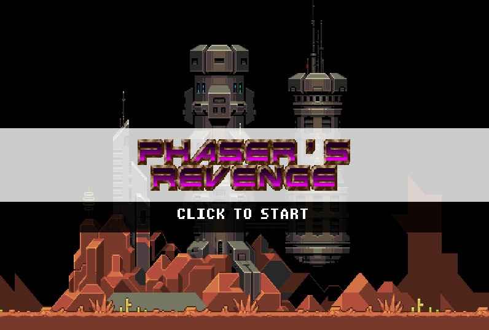

# Skyy Tribes 2

A simple hack n slash arcade game that builds on the first title. Take on masses of enemies while expanding the claim on the land. Improve quality of life for citizens and build the city better.

### Story
Following his feats in the Battle of the New Moon, Moon Chief, now Chief in Command of the tribe, focused on strengthening his people.
With his loyal contingent of warriors he set out to rid the region of their enemies.

## System Info
- Genre: Arcade
- Dimensions: 480 (design) x 240 height
- Engine: Phaser JS
- Platform: Browser Game
## Build Info
| Command | Description |
|---------|-------------|
| `npm install` | Install project dependencies |
| `npm run dev` | Launch a development web server |
| `npm run build` | Create a production build in the `dist` folder |
[Version 1] Skyy Tribes 2 - The second game in the series.
Built using Phaser JS and designed for keyboard and controller play.

All Rights Reserved.